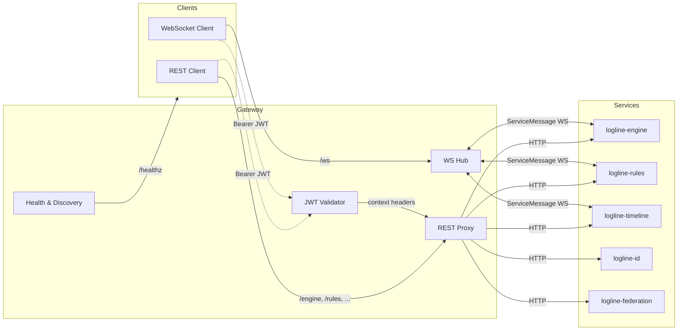
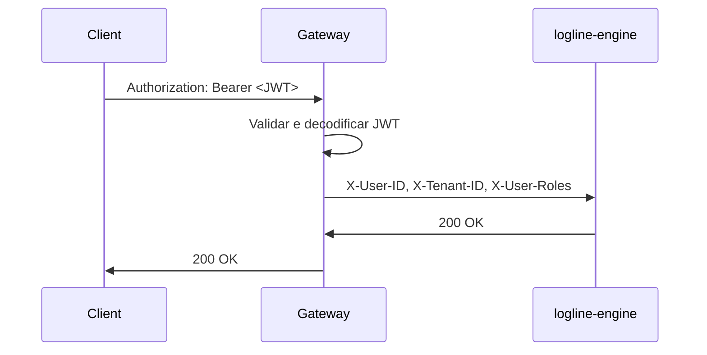

# LogLine API Gateway

O serviço **logline-gateway** centraliza o tráfego REST e WebSocket do LogLine Universe,
funcionando como ponto único de entrada para clientes externos e coordenando a
comunicação entre os microserviços internos.

## Objetivos

- Expor uma fachada HTTP única com roteamento / proxy para engine, rules, timeline,
  identidade e federation.
- Encaminhar mensagens em tempo real entre clientes externos e a malha de serviços
  usando o envelope `ServiceMessage`.
- Monitorar a saúde dos peers e publicar um estado agregado no endpoint `/healthz`.
- Detectar desconexões da malha e restabelecer conexões automaticamente.

## Visão Geral



## Modelo de Segurança e Fronteira de Confiança

O gateway é o **único** ponto do universo autorizado a validar tokens JWT. Todos
os clientes externos apresentam o token no header `Authorization: Bearer ...` e
o gateway executa as seguintes etapas:

1. **Validação**: `jsonwebtoken` verifica assinatura, emissor, audiência e
   expiração.
2. **Decodificação**: o contexto autenticado (usuário, tenant, roles) é
   armazenado na `AuthContext` interna.
3. **Injeção de Contexto**: para cada chamada encaminhada aos microserviços, o
   gateway acrescenta headers explícitos com a identidade autenticada.



### Headers propagados

| Header          | Conteúdo                              |
|-----------------|----------------------------------------|
| `X-User-ID`     | Identificador do usuário autenticado   |
| `X-Tenant-ID`   | Tenant atual (quando presente no token) |
| `X-User-Roles`  | Lista de roles/escopos separados por espaço |
| `X-Service-Token` | Token interno opcional para _service-to-service_ |

### Modos de falha

- **Token ausente ou inválido** → resposta `401 Unauthorized`.
- **Audience/issuer incorretos** → `SecurityError::InvalidToken` registrado e
  request descartada.
- **Header inválido** → gateway registra `warn!` e descarta o header antes de
  encaminhar (evita poison headers).
- **Serviço interno fora do ar** → camadas de resiliência (`retry`, dead letter)
  registram a falha sem expor dados sensíveis ao cliente.

## Exemplos de uso

### Proxy REST

```bash
curl -X POST \
  "http://localhost:8070/rules/tenants/acme/rules" \
  -H "Content-Type: application/json" \
  -d '{"rule_id":"notify","definition":{...}}'
```

O gateway encaminha a requisição para `logline-rules`, preservando método, headers
(exceto `Host`/`Content-Length`) e corpo. O microserviço recebe os headers de
contexto `X-User-ID`, `X-Tenant-ID` e `X-User-Roles`, não precisando lidar com
JWTs diretamente.

### Hub WebSocket

1. Conecte-se ao gateway:

```bash
wscat -c ws://localhost:8070/ws
```

2. Envie um envelope `ServiceMessage`:

```json
{"event":"span_created","payload":{"type":"span_created","span_id":"abc","span":{"name":"demo"}}}
```

O gateway roteará automaticamente a mensagem para `logline-timeline` e `logline-rules`
e distribuirá o envelope para outros clientes conectados.

## Health check e reconexão

- O endpoint `/healthz` consulta o `/health` de cada serviço interno via `reqwest` e
  consolida o resultado em JSON (status `ok` ou `degraded`).
- A malha WebSocket utiliza `ServiceMeshClient` do `logline-core` para manter
  conexões persistentes. Caso um peer caia, o cliente realiza _backoff_ exponencial
  e reconecta automaticamente, emitindo `ConnectionLost` para os consumidores.

## Executando localmente

```bash
cargo run -p logline-gateway
```

Variáveis de ambiente relevantes:

| Variável            | Descrição                              | Default                  |
|---------------------|----------------------------------------|--------------------------|
| `GATEWAY_BIND`      | Endereço de escuta do gateway          | `0.0.0.0:8070`           |
| `ENGINE_URL`        | Base HTTP do logline-engine            | `http://127.0.0.1:8090`  |
| `RULES_URL`         | Base HTTP do logline-rules             | `http://127.0.0.1:8081`  |
| `TIMELINE_URL`      | Base HTTP do logline-timeline          | `http://127.0.0.1:8082`  |
| `ID_URL`            | Base HTTP do logline-id                | `http://127.0.0.1:8083`  |
| `FEDERATION_URL`    | Base HTTP do logline-federation        | `http://127.0.0.1:8084`  |
| `*_WS_URL`          | (Opcional) URL WebSocket específica    | Derivada automaticamente |

Ao iniciar, o gateway registrará os peers ativos e publicará logs usando `tracing`.
